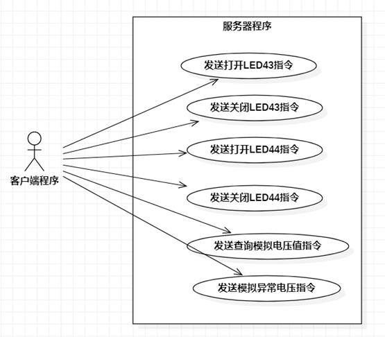
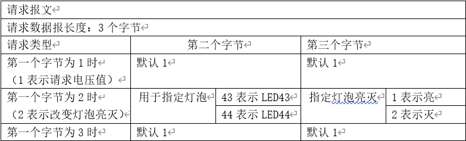

# 远程电压监控系统

**功能：**

（1）单片机安装嵌入式Linux，具备触摸屏。单片机与PC机通过WIFI连接实现同一网络下的通讯。

（2）运行在单片机上的服务端可以响应PC机的命令，实现电压检测，led灯控制，及异常电压报警功能。

（3）PC机上的客户端具备图形界面，可以以折线图的方式显示电压值，与用户进行交互。

（4）利用Qt的跨平台性，单片机上也可以运行触屏版的客户端程序。

**架构图：**


**用例图：**




**应用层协议设计：**




# 常用命令

1.连接wifi

```shell
nmcli dev			#查看wifi设备
nmcli r wifi on/off #开关wifi
nmcli dev wifi 		#扫描wifi热点
nmcli dev wifi connect "{SSID}" password "{pw}" ifname wlan0 #连接

ifconfig 			#查看ip
```

2.传输文件

```shell
ssh pi@{ip}			#连接 pw:pi
ssh -l root {ip}	#连接 pw:fa

scp {localPath} root@{ip}://{destinationPath}		#上传
scp root@{ip}://{destinationPath} {localPath}		#上传
```

3.设备文件

目录:

```shell
cd /sys/devices/platform/c0000000.soc/c0053000.adc/iio\:device0/
ls
in_vltage?_raw
```

read.c

```c
#include<stdio.h>
#include<stdlib.h>
#include<fcntl.h>
#include <sys/stat.h>
#include <unistd.h>

int main(){
    int fd;
    char buf[20];
    int len;
    
    fd = open("/sys/devices/platform/c0000000.soc/c0053000.adc/iio:device0/in_voltage7_raw", 0);
    if(fd<0) exit(1);
    len = read(fd, buf,sizeof buf - 1);
    if(len > 0){
        buf[len] = '\0';
        printf("%s\n",buf);
    }
    close(fd);
    return 0;
}
```

4.灯泡控制

```shell
cd /sys/class/gpio
for i in gpiochip*; do echo `cat $i/label`:`cat $i/base`;done	#查看引脚映射

echo 43 > export	#控制gpiob11(32+11)

cd gpio43	#到gpio43目录下
ls			#direction可以配置输入输出，高低电平
echo high > direction
echo 1 > value

```

